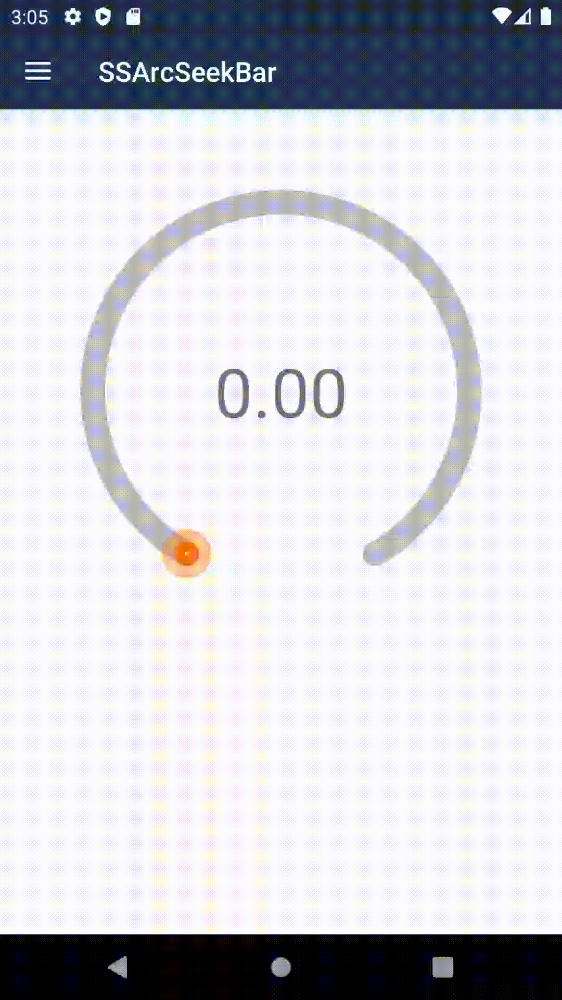
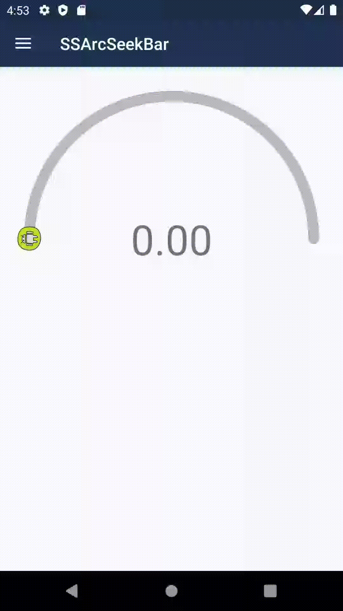
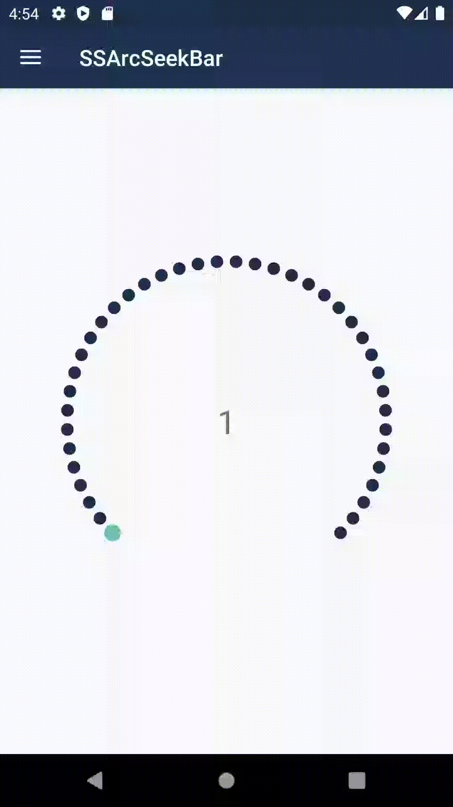
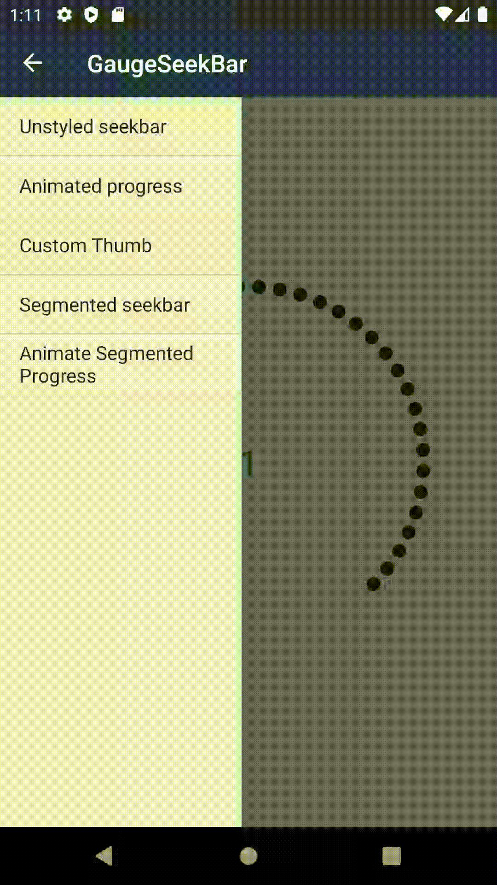

# 🌈 SSArcSeekBar
#### Choose your way to flaunt the progress.
[](https://developer.android.com/studio/)
[](https://jitpack.io/#SimformSolutionsPvtLtd/SSArcSeekBar)

[](https://kotlinlang.org)
[](https://android-arsenal.com/api?level=21)

Different type of arc seekbar. Easy to use and configure your own seekbar using all the attributes.

## Features :

* Basic arc seekbar
* Basic arc custom thumb seekbar
* Basic arc seekbar with animation
* Segmented arc seekbar 
* segmented arc seekbar with animation
* Options with Basic Arc Seekbar :
    - Change start angle
    - Change progress thumb and its radius
    - Show/hide thumb
    - put progress thumb outside its track
    - Change track width, color
    - Progress color
* Option with Segmented Arc Seekbar :
    - Change start angle
    - set sweep angle
    - set Max value for arc
    - set Progress radius
    - Change colors of progress and track
    - Set progress thickness for continuous type


# 🎬 Preview

| Basic arc seekbar | Custom thumb arc seekbar |
|--|--|
|  |  |

| Segmented arc seekbar | Animate Progress on start |
|--|--|
 |  |

## 🤔 How to use it
1. Add it in your root build.gradle at the end of repositories:

   ```groovy
         allprojects {
             repositories {
                 maven { url 'https://jitpack.io' }
             }
         }
   ```

* Add the dependency in your app's build.gradle file

  ```groovy
        dependencies {
	        implementation 'com.github.SimformSolutionsPvtLtd:SSArcSeekBar:1.0.2'
	    }
  ```
  
* Use this code in xml file (Basic arc seekbar)
  
  ```kotlin
        <com.ssarcseekbar.app.GaugeSeekBar
            android:id="@+id/progress"
            android:layout_width="0dp"
            android:layout_height="0dp"
            app:layout_constraintDimensionRatio="1"
            app:layout_constraintEnd_toEndOf="parent"
            app:layout_constraintStart_toStartOf="parent"
            app:layout_constraintTop_toTopOf="parent"
            app:thumbRadius="18dp"
            app:trackWidth="18dp" />
  ```
  
* Now get the progress 

  ```kotlin
        view.progress.progressChangedCallback = {
            progressText.text = String.format("%.2f", it)
        }
  ```

* Custom Thumb arc seekbar with gradiant color

  ```kotlin
        <com.ssarcseekbar.app.GaugeSeekBar
            android:id="@+id/progress"
            ...
            app:startAngleDegrees="90"
            app:thumbColor="@color/colorPrimary"
            app:thumbDrawable="@drawable/custom_thumb"
            app:trackGradient="@array/progressRainbow"
            app:trackWidth="13dp" />
  ```
  
* Segmented arc seekbar

  ```kotlin
        <com.ssarcseekbar.app.segmented.SegmentedArc
            android:id="@+id/segmentedArc"
            android:layout_width="match_parent"
            android:layout_height="match_parent"
            app:max="40"
            app:progress_primary_circle_size="20"
            app:progress_primary_color="@color/color_progress"
            app:progress_radius="380"
            app:progress_secondary_circle_size="15"
            app:progress_secondary_color="@color/colorPrimaryDark"
            app:start_offset="40" />
  ```
  
* Add animation for the progress, show animation when it is first time loaded on screen 

  ```kotlin
        // Create a function to animate progress 
        private fun valueAnimator(oldProgressValue: Int, newProgressValue: Int) {
            val valueAnimator = ValueAnimator.ofInt(oldProgressValue, newProgressValue)
            valueAnimator.duration = 1000
            valueAnimator.addUpdateListener {
                view?.segmentedArcSeekbar?.progress = it.animatedValue as Int
            }
            valueAnimator.start() 
        }

        // Add delay before starting the animation
        lifecycleScope.launch(Dispatchers.Main) {
            delay(1000)
            valueAnimator(view.segmentedArcSeekbar.getMax(), oldProgressValue)
        }
  ```

### All Attributes
------------------------

### Basic Arc Seekbar

| Attribute | Description | Default |
| --- | --- | --- |
| `startAngleDegrees` | From which angle do you want to start your arc. | `30` |
| `thumbRadius` | Radius of thumb in seekbar. | `11` |
| `thumbDrawable` | Set custom icon for thumb. | None |
| `showThumb` | Show/hide thumb according to your need. | `true` |
| `isThumbOutside` | If true then it will set thumb outside the progress track. | `false` |
| `thumbColor` | Set thumb color when not using any image/drawable for it. | `orange` |
| `trackGradient` | Used to set array of colors for track. can be used with single color. | `grey` |
| `showProgress` | Show/hide progress according to your need. | `true` |
| `progress` | Set default progress. | `0` |
| `trackWidth` | set width of seekbar track and progress. | `8` |
| `progressGradient` | Array of colors for progress. Can be used with single color. | `green, red` |

### Segmented Arc Seekbar

| Attribute | Description | Default |
| --- | --- | --- |
| `start_progress` | Set default start progress. | `1` |
| `start_offset` | Set the seekbar start offset angle from bottom horizontal center. | `30` |
| `sweep_angle` | Set total angle covered by arc. | `-1` |
| `max` | Set the maximum value of the seekbar. | `25` |
| `min` | Set the minimum value of the seekbar. | `1` |
| `progress_radius` | Set the radius of the progress arc. | `-1` |
| `progress_primary_color` | Set the progress color. | `yellow` |
| `progress_secondary_color` | Set the track color. | `black` |
| `progress_primary_circle_size` | Set the progress circle size. | `-1` |
| `progress_secondary_circle_size` | Set the track circle size.. | `-1` |
| `progress_primary_stroke_width` | Set the progress thickness for continuous type. | `25` |
| `progress_secondary_stroke_width` | Set the track thickness for continuous type. | `10` |


## Other Library used:
* __[GaugeSeekbar](https://github.com/10clouds/GaugeSeekBar)__
* __[Croller](https://github.com/harjot-oberai/Croller)__

## Find this library useful? ❤️
Support it by joining __[stargazers](https://github.com/SimformSolutionsPvtLtd/SSArcSeekBar/stargazers)__ for this repository..⭐

## 🤝 How to Contribute

Whether you're helping us fix bugs, improve the docs, or a feature request, we'd love to have you! 💪
Check out our [**Contributing Guide**](https://github.com/SimformSolutionsPvtLtd/SSArcSeekBar/blob/master/CONTRIBUTING.md) for ideas on contributing.

## 🐛 Bugs and Feedback

For bugs, feature requests, and discussion please use [GitHub Issues](https://github.com/SimformSolutionsPvtLtd/SSArcSeekBar/issues).

## Awesome Mobile Libraries
- Check out our other available [awesome mobile libraries](https://github.com/SimformSolutionsPvtLtd/Awesome-Mobile-Libraries)

## License

  ```
Copyright 2021 Simform Solutions

 Licensed under the Apache License, Version 2.0 (the "License");
 you may not use this file except in compliance with the License.
 You may obtain a copy of the License at
    http://www.apache.org/licenses/LICENSE-2.0
 Unless required by applicable law or agreed to in writing, software
 distributed under the License is distributed on an "AS IS" BASIS,
 WITHOUT WARRANTIES OR CONDITIONS OF ANY KIND, either express or implied.
 See the License for the specific language governing permissions and limitations under the License.
```
